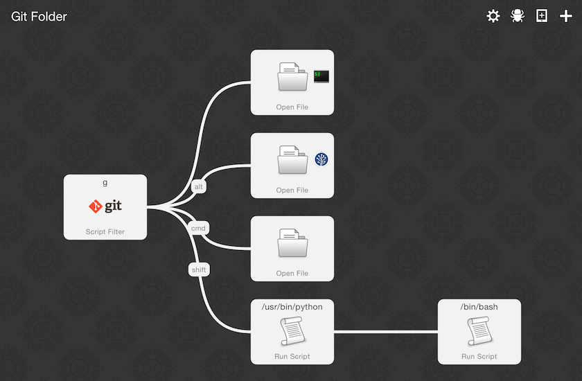
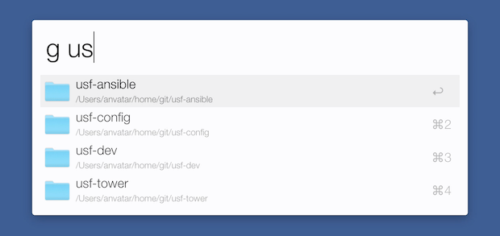

# git-folder 워크플로우

OS X에서 Git 저장소를 다루다보면 다음과 같은 동작을 매일 반복적으로 수행하게 됩니다.

* 터미널(Terminal, iTerm 2, ...)을 열고 로컬 저장소 위치로 이동하기
* 로컬 저장소를 Finder에서 열기
* 로컬 저장소를 SourceTree에서 보기
* 웹브라우저(Safari, Google Chrome, ...)에서 원격 저장소 페이지(github.com 등) 보기

지금부터 소개하는 Alfred 2 워크플로우를 이용하면 위와 같은 동작을 키보드 타이핑 몇 번으로 수행할 수 있습니다.

## 설치

시스템 요구사항

* [Alfred 2](http://www.alfredapp.com)
* [Alfred 2 Powerpack](https://buy.alfredapp.com) (유료)

[최신 릴리즈 페이지](https://github.com/anvatar/git-folder-alfredworkflow/releases/latest) 에서 `git-folder.alfredworkflow` 파일을 다운로드 하고 실행하면 Alfred 환경설정창이 열리면서 워크플로우 불러오기 대화상자가 나타납니다. [Import] 버튼을 누르면 "git-folder"라는 이름의 워크플로우가 생성됩니다. 이 워크플로우는 다음 그림과 같이 구성되어 있습니다.



## 설정 변경

Git 로컬 저장소를 발견할 수 있는 위치를 워크플로우 설정에 반영해야만 워크플로우를 이용할 수 있습니다.

워크플로우 구성 요소 중 git 로고를 포함하고 있는 Script Filter 요소를 더블클릭하여 엽니다. Script 텍스트 필드 내 Python 스크립트는 다음과 같이 시작합니다.

```
git_homes = [
]

. . .
```

Git 로컬 저장소를 담고 있는 상위 디렉토리의 절대 경로를 `git_homes`의 값에 넣어주면 됩니다. 문자열의 리스트 타입이므로 여러 개의 상위 디렉토리를 지정할 수 있습니다.

예를 들어 저는 `~/home/git` 아래에 로컬 저장소를 생성하기 때문에, `git_homes`를 다음과 같이 설정합니다.

```
git_homes = [
	"/Users/anvatar/home/git",
]
```

## 사용 방법

Alfred 검색창을 띄우고 `g`를 입력하고 스페이스바를 누릅니다. 그리고 쿼리를 입력하기 시작하면 다음 그림처럼 디렉토리명이 입력한 단어들을 모두 포함하는 로컬 저장소만 필터링 되어 목록에 나타납니다.



현재 하이라이트 되어 있는 항목에 대해 다음과 같은 명령을 내릴 수 있습니다.

* ⏎ - iTerm 2에서 열기
	* (iTerm 2) 같은 창 내의 모든 세션에 입력을 동시에 전달하게 되어 있을 때 수행하면, 모든 세션에 `cd ...` 문자열이 입력됩니다.
* Cmd + ⏎ - Finder에서 열기
* Option + ⏎ - SourceTree에서 열기
* Shift + ⏎ - 원격 저장소 페이지 기본 웹브라우저에서 열기

## 사용자화

워크플로우의 각 구성 요소(일부 연결선 포함)의 설정을 조정하면 다음과 같은 부분을 쉽게 변경할 수 있습니다.

* 현재 `g`로 지정되어 있는 키워드를 다른 문자열로 변경
* Cmd, Option, Ctrl, Shift와 같은 *modifier* 키의 용도 변경
* iTerm 2, SourceTree, 기본 웹브라우저 아닌 다른 앱과 연결
